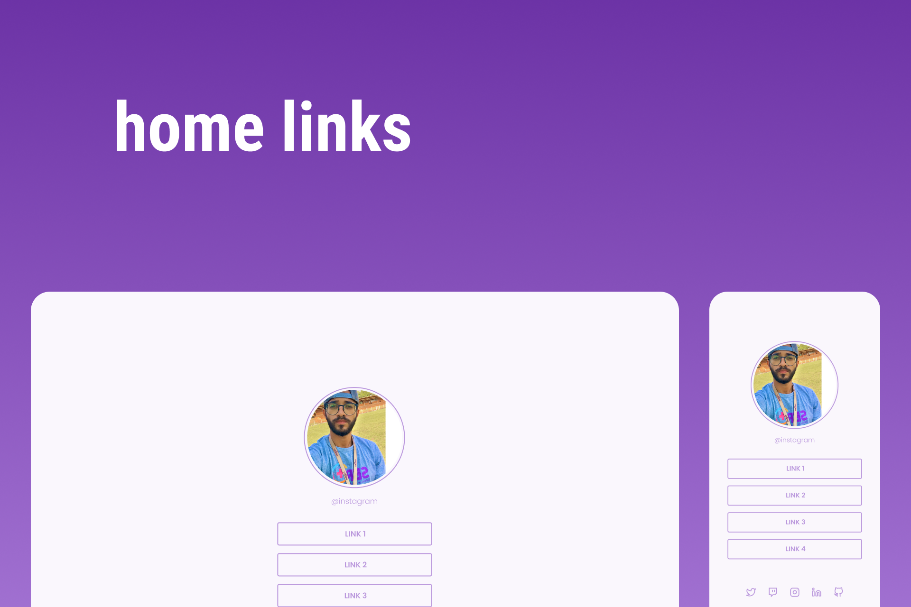

<h1 align="center"> Home Links </h1>

 

  

## 🚀 Tecnologias

Esse projeto foi desenvolvido com as seguintes tecnologias:

- HTML e CSS
- JavaScript
- Git e Github

## 💻 Projeto

O home-Links é um agregador de links para usar como cartão de visitas online.

- [Acesse o projeto finalizado, online](https://ricantony6.github.io/homelinks)

♥ Ricardo Antonio Rodrigues
